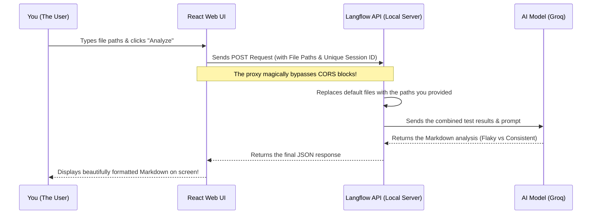

# 🕵️‍♂️ Flaky Test Analyzer AI Agent

Welcome to the **Flaky Test Analyzer AI Agent**! This project is a smart, AI-powered tool designed to solve a very annoying problem in software testing: **Flaky Tests** (tests that sometimes pass and sometimes fail without any code changes).

This tool allows you to take the test results from two different builds (Build 1 and Build 2), feed them into an AI, and get an instant summary of which tests are genuinely failing and which ones are just being flaky.

---

## 🧩 The Two Main Pieces

We built this tool using two main components that talk to each other:

1. **The Brain (Langflow API)**
   This is the backend engine. We created a visual flow in Langflow that takes in two JSON files (your test results), combines them, and sends a prompt to an AI model (like Groq/GPT). The AI reads the results, compares them, and generates a plain-English summary.

2. **The Face (React Web UI)**
   Because nobody wants to run complicated terminal commands to test their builds, we built a beautiful, lightweight web page (using React and Vite). This web page gives you two simple input boxes to specify where your test result files are on your computer. When you click "Analyze Runs," it talks to the Brain and displays the result nicely on your screen.

---

## 🔄 How the Magic Happens (The Flow)

Here is a simple graph showing exactly how information flows when you click the "Analyze" button:



---

## 🛠️ The "Gotchas" (What we learned building this)

Building the connection between the React UI and the Langflow Backend wasn't perfectly smooth. Here are three major hurdles we overcame to make it work seamlessly:

### 1. The CORS Blockade ("Failed to Fetch")
* **The Problem:** Web browsers have strict security rules (CORS). Because our UI was running on `localhost:5173` and Langflow was running on `localhost:7860`, the browser panicked and blocked the connection.
* **The Fix:** We set up a **Proxy** in the UI's configuration (`vite.config.js`). Instead of the UI talking directly to Langflow, the UI talks to itself (`/api/v1/...`), and the Vite server silently forwards the request to Langflow behind the scenes. The browser stays happy!

### 2. The "Stubborn Memory" Issue (Session Caching)
* **The Problem:** When we clicked "Analyze," Langflow kept giving us the exact same answer from a previous run, completely ignoring our new files.
* **The Fix:** Langflow remembers conversations based on a `session_id`. We were sending a hardcoded ID (`postman-session-1`). We fixed this by generating a brand new, random ID (using the current time) every time you click the button. Now, Langflow treats every click as a completely fresh, amnesiac session.

### 3. The "Ignored Files" Issue (Tweak IDs)
* **The Problem:** Even after fixing the session caching, Langflow was *still* analyzing its own default files instead of the ones we typed in the UI.
* **The Fix:** When sending "tweaks" (overrides) to Langflow, the labels you use in your API request must **exactly match** the hidden, internal IDs of the nodes in your Langflow canvas. We were sending `"File-XXXXX"`. We opened the Langflow JSON blueprint, hunted down the true internal IDs (`File-QGi3B` and `File-LGRrN`), and used those in our React code. Once they matched perfectly, Langflow successfully injected our UI files!

---

## 🚀 How to Run It

1. **Start the Langflow Backend:** Make sure your Langflow server is running and accessible at `http://localhost:7860`.
2. **Start the UI:** Open a terminal in the `UI` folder and run:
   ```bash
   npm run dev
   ```
3. Open `http://localhost:5173` in your browser, enter your absolute JSON file paths, and hit **Analyze Runs**!
